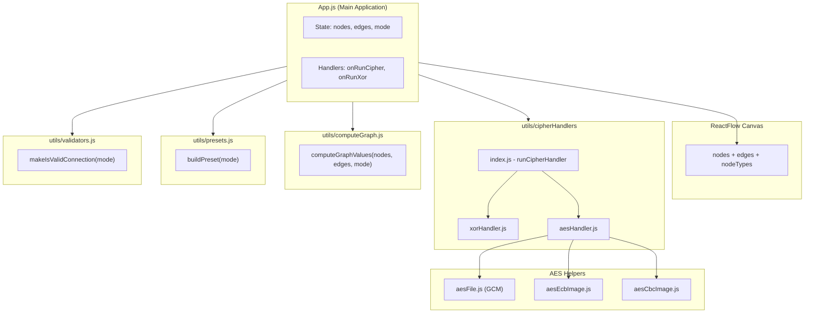
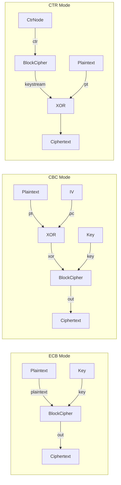
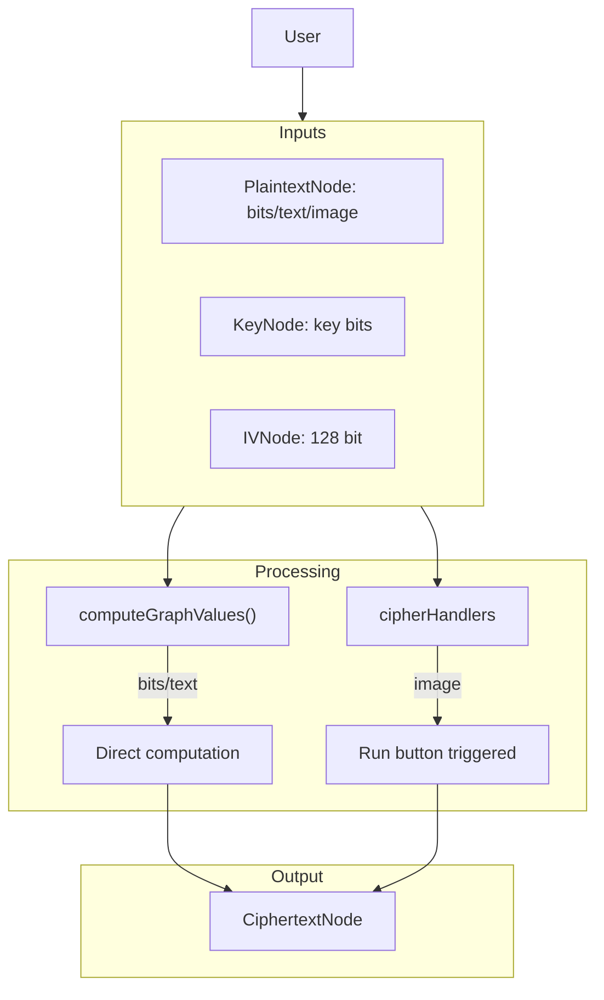
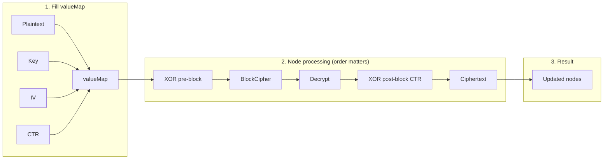
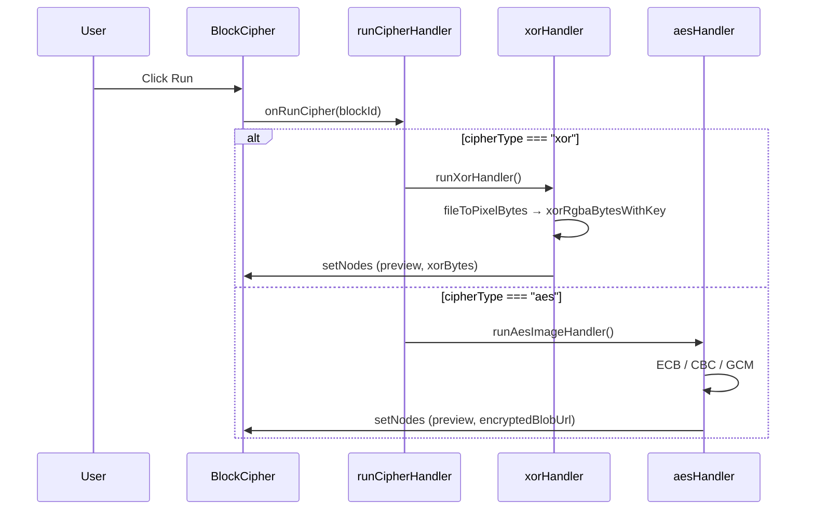
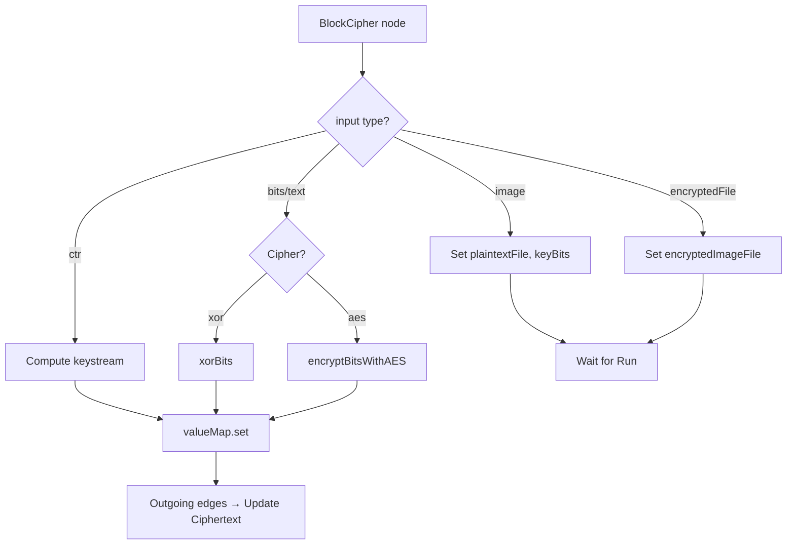

# 🔐 Block Cipher Simulation Project – Documentation

This document describes the project structure, recent changes, and data flow.

---

## 📋 Table of Contents

1. [Project Overview](#1-project-overview)
2. [Recent Changes](#2-recent-changes)
3. [Project Structure](#3-project-structure)
4. [UML – Component Diagram](#4-uml--component-diagram)
5. [UML – Node Types and Connections](#5-uml--node-types-and-connections)
6. [Data Flow](#6-data-flow)
7. [Modes (ECB, CBC, CTR)](#7-modes-ecb-cbc-ctr)

---

## 1. Project Overview

**Purpose:** A React application that simulates ECB, CBC, and CTR block cipher modes in a visual graph interface.

**Technologies:**
- React 19 + ReactFlow (graph canvas)
- CryptoJS (AES encryption)
- crypto-js, node-forge

**Main Features:**
- Bit/text/image encryption with XOR and AES algorithms
- ECB, CBC, CTR modes
- Drag-and-drop node connections
- AES SubBytes visualization

---

## 2. Recent Changes

### 2.1 cipherHandlers.js Split

**Before:** Single file, ~634 lines

**After:** Modular structure under `cipherHandlers/` folder:

```
cipherHandlers/
├── bitsToHex.js    → Binary → Hex conversion
├── xorHandler.js   → XOR encryption (image + ECB/CBC)
├── aesHandler.js   → AES ECB, CBC, GCM (image mode)
└── index.js        → runCipherHandler (router)
```

| File | Lines | Responsibility |
|------|-------|----------------|
| `bitsToHex.js` | ~12 | `bitsToHex(bits)` helper function |
| `xorHandler.js` | ~131 | `runXorHandler` – XOR image encryption |
| `aesHandler.js` | ~190 | `runAesImageHandler` – AES ECB/CBC/GCM image |
| `index.js` | ~88 | `runCipherHandler`, `runXorHandler`, `bitsToHex` exports |

### 2.2 DES Algorithm Removal

Unused DES code was removed:

| Removed | Description |
|---------|-------------|
| `desFile.js` | File deleted entirely |
| `cipherHandlers` | DES import and handler removed |
| `computeGraph.js` | `encryptBitsWithDES`, `decryptBitsWithDES` and all DES branches |
| `BlockCipherNode.jsx` | DES fallback logic |
| `CiphertextNode.jsx` | `cipherType === "des"` checks |
| `DecryptNode.jsx` | DES option removed from dropdown |

### 2.3 Summary

```
Before:  cipherHandlers.js (634 lines) + desFile.js + DES code everywhere
After:   cipherHandlers/ (4 modules, ~420 lines) + no DES
```

---

## 3. Project Structure

```
src/
├── App.js                    # Main app, state, event handlers
├── index.js
├── index.css
│
├── components/
│   ├── nodes/                # ReactFlow node components
│   │   ├── PlaintextNode.jsx # Input (bits/text/image)
│   │   ├── KeyNode.jsx       # Key
│   │   ├── BlockCipherNode.jsx # XOR or AES selection + Run
│   │   ├── CiphertextNode.jsx  # Encrypted output
│   │   ├── IVNode.jsx        # IV for CBC
│   │   ├── XorPreBlockNode.jsx # CBC: PT ⊕ IV
│   │   ├── CtrNode.jsx       # CTR: nonce + counter
│   │   └── DecryptNode.jsx   # Decryption (AES)
│   │
│   ├── aes/
│   │   └── SubBytesView.jsx  # AES SubBytes visualization
│   │
│   ├── crypto/
│   │   └── imageToBytes.js   # Image → pixel byte array
│   │
│   ├── layout/
│   │   ├── ModeMenu.jsx      # ECB/CBC/CTR/Free selection
│   │   ├── StepEdge.jsx
│   │   └── SineEdge.jsx
│   │
│   └── palette/
│       └── NodePalette.jsx   # Drag-and-drop node palette
│
└── utils/
    ├── cipherHandlers/       # Visual encryption (image mode)
    │   ├── index.js
    │   ├── bitsToHex.js
    │   ├── xorHandler.js
    │   └── aesHandler.js
    │
    ├── computeGraph.js       # Bit/text encryption + graph computation (~1000 lines)
    ├── presets.js            # ECB/CBC/CTR/Free preset nodes + edges
    ├── validators.js         # Connection rules (which node connects where)
    │
    ├── aesFile.js            # AES-GCM file encryption
    ├── aesEcbImage.js        # AES-ECB image (block by block)
    ├── aesCbcImage.js        # AES-CBC image (IV + chain)
    ├── aesSBox.js            # AES S-Box table
    ├── aesViewData.js        # Data preparation for SubBytes view
    │
    ├── imageXor.js           # RGBA ⊕ key bits
    ├── xorImageFile.js       # Image XOR helper
    ├── bitwise.js            # xorBits(bit1, bit2)
    ├── bytesToDataUrl.js     # Byte[] → PNG data URL
    │
    ├── ecbTrace.js           # ECB first N blocks trace
    └── nodeHelpers.js        # checkModeForDeleteButton etc.
```

---

## 4. UML – Component Diagram



---

## 5. UML – Node Types and Connections



### Node Types Table

| Node | Type | Input | Output | Usage |
|------|------|-------|--------|-------|
| **PlaintextNode** | plaintext | bits/text/image/encryptedFile | value | Plaintext or encrypted file |
| **KeyNode** | key | bits / keyText | bits, keyText | Key (binary or hex) |
| **BlockCipherNode** | blockcipher | plaintext/xor, key | out | XOR or AES, triggered by "Run" |
| **CiphertextNode** | ciphertext | in (BlockCipher/XOR) | - | Encrypted result |
| **IVNode** | iv | bits (128 bit) | bits | Initialization vector for CBC |
| **XorPreBlockNode** | xor | pt, pc (IV/prevCipher) | out | PT ⊕ IV or PT ⊕ prevCT |
| **CtrNode** | ctr | nonceBits, counterBits | ctr | Nonce + counter for CTR mode |
| **DecryptNode** | decrypt | encrypted, key | out | AES decryption |

---

## 6. Data Flow

### 6.1 High-Level Data Flow



### 6.2 computeGraphValues Data Flow



### 6.3 Run Button (Image Mode) Flow



### 6.4 computeGraph Internal Flow (BlockCipher)



---

## 7. Modes (ECB, CBC, CTR)

### ECB (Electronic Codebook)

```
Plaintext ──┬──► BlockCipher ──► Ciphertext
            │        ▲
Key ────────┴────────┘

Each block is encrypted independently. Same plaintext = same ciphertext.
```

### CBC (Cipher Block Chaining)

```
Plaintext ──► XOR ◄── IV (or prevCipher)
              │
              ▼
         BlockCipher ──► Ciphertext ──► (prevCipher for next block)
              ▲
Key ──────────┘

PT ⊕ IV (or prevCT) → BlockCipher → CT. Hides patterns.
```

### CTR (Counter)

```
CtrNode(nonce+counter) ──► BlockCipher ──► Keystream
                                              │
Plaintext ────────────────────────────────────► XOR ──► Ciphertext

Keystream = E(nonce||counter, key)
CT = PT ⊕ Keystream
```

---

## 8. File Dependencies (Summary)

```
App.js
├── cipherHandlers (runCipherHandler, runXorHandler)
├── computeGraph (computeGraphValues)
├── presets (buildPreset)
├── validators (makeIsValidConnection)
├── ecbTrace
└── node components

cipherHandlers/index.js
├── xorHandler
├── aesHandler
└── bitsToHex

cipherHandlers/aesHandler.js
├── aesFile
├── aesEcbImage
├── aesCbcImage
├── imageToBytes
├── bytesToDataUrl
└── bitsToHex

computeGraph.js
├── bitwise (xorBits)
├── crypto-js
└── (own helpers: bitsToHex, textToBinary, encryptBitsWithAES, decryptBitsWithAES)
```

---

## 9. Important Notes

- **Image mode:** When image/encryptedFile is selected in PlaintextNode, processing is done via `cipherHandlers`; the **Run** button must be clicked.
- **Bit/text mode:** `computeGraphValues` runs automatically on edge changes and node changes.
- **computeGraph.js** is still ~1000 lines; it can be split similarly to `cipherHandlers` in the future.
