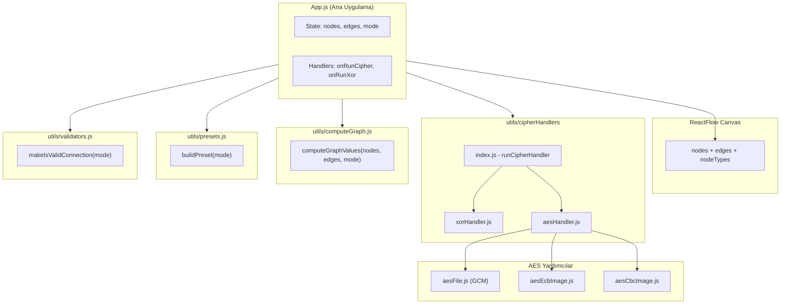
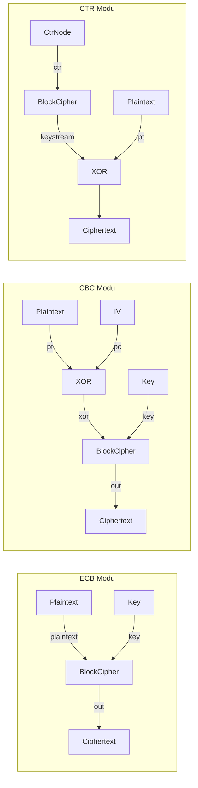
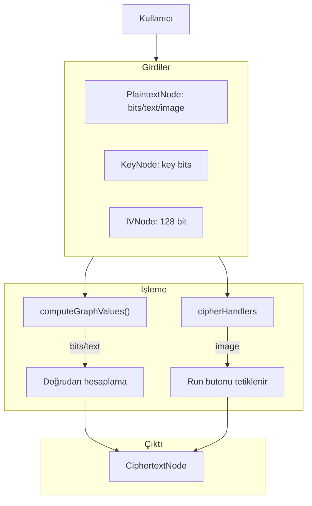
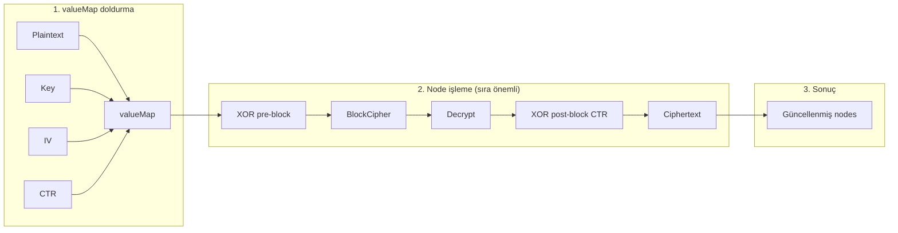
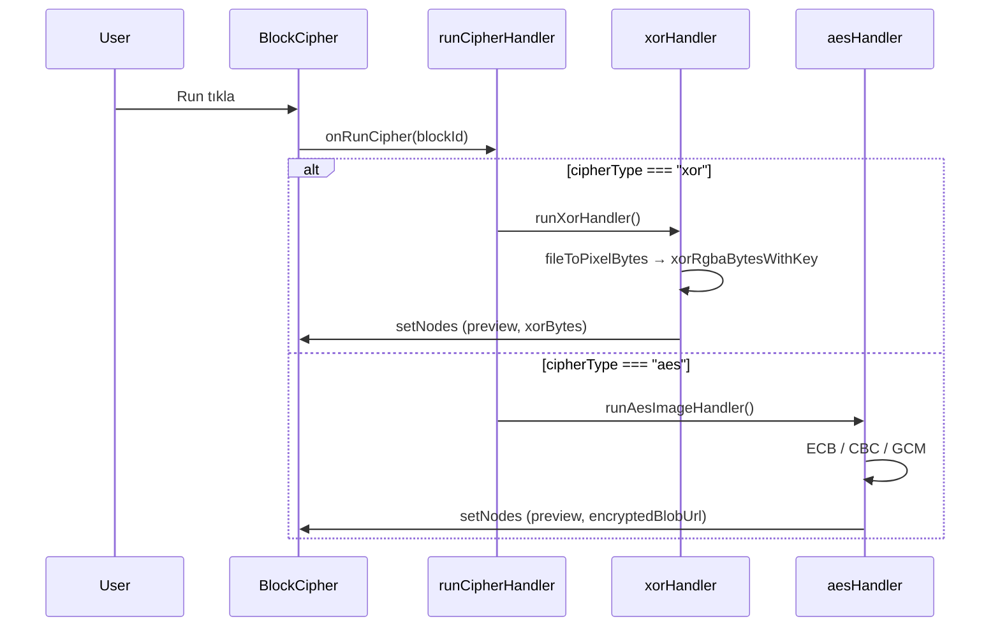
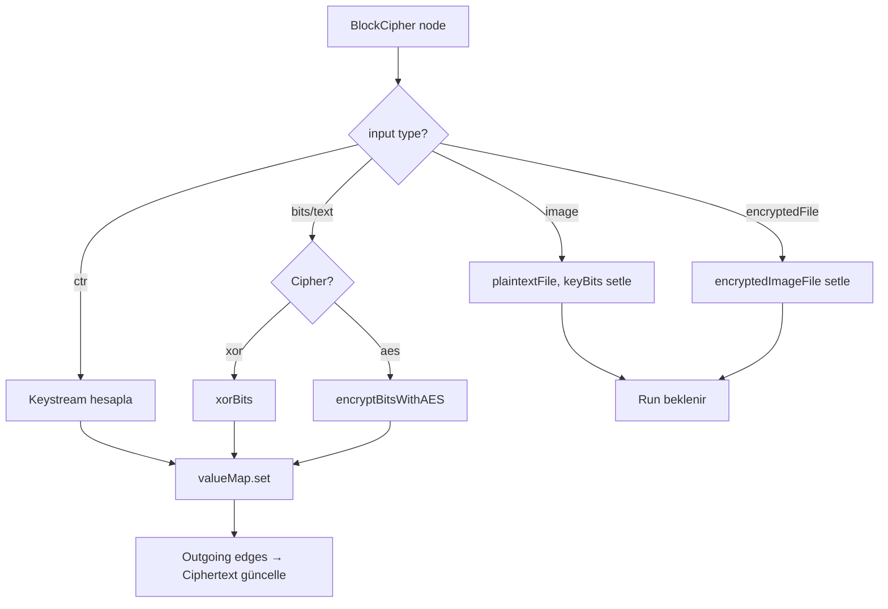

# 🔐 Şifreleme Simülasyonu Projesi – Dokümantasyon

Bu dosya projenin mevcut yapısını, dünden beri yapılan değişiklikleri ve veri akışını açıklar.

---

## 📋 İçindekiler

1. [Proje Özeti](#1-proje-özeti)
2. [Dünden Beri Yapılan Değişiklikler](#2-dünden-beri-yapılan-değişiklikler)
3. [Proje Yapısı](#3-proje-yapısı)
4. [UML – Bileşen Diyagramı](#4-uml--bileşen-diyagramı)
5. [UML – Node Tipleri ve Bağlantılar](#5-uml--node-tipleri-ve-bağlantılar)
6. [Veri Akışı](#6-veri-akışı)
7. [Modlar (ECB, CBC, CTR)](#7-modlar-ecb-cbc-ctr)

---

## 1. Proje Özeti

**Amaç:** ECB, CBC ve CTR blok şifre modlarını görsel bir grafik arayüzünde simüle eden bir React uygulaması.

**Teknolojiler:**
- React 19 + ReactFlow (grafik canvas)
- CryptoJS (AES şifreleme)
- crypto-js, node-forge

**Ana Özellikler:**
- XOR ve AES algoritmaları ile bit/metin/resim şifreleme
- ECB, CBC, CTR modları
- Sürükle-bırak ile node bağlama
- AES SubBytes görselleştirmesi

---

## 2. Dünden Beri Yapılan Değişiklikler

### 2.1 cipherHandlers.js Parçalanması

**Önce:** Tek dosya, ~634 satır

**Sonra:** `cipherHandlers/` klasörü altında modüler yapı:

```
cipherHandlers/
├── bitsToHex.js    → Binary → Hex dönüşümü
├── xorHandler.js   → XOR şifreleme (resim + ECB/CBC)
├── aesHandler.js   → AES ECB, CBC, GCM (resim modu)
└── index.js        → runCipherHandler (router)
```

| Dosya | Satır | Sorumluluk |
|-------|-------|------------|
| `bitsToHex.js` | ~12 | `bitsToHex(bits)` yardımcı fonksiyonu |
| `xorHandler.js` | ~131 | `runXorHandler` – XOR ile resim şifreleme |
| `aesHandler.js` | ~190 | `runAesImageHandler` – AES ECB/CBC/GCM resim |
| `index.js` | ~88 | `runCipherHandler`, `runXorHandler`, `bitsToHex` export |

### 2.2 DES Algoritmasının Kaldırılması

Kullanılmayan DES kodu kaldırıldı:

| Kaldırılan | Açıklama |
|------------|----------|
| `desFile.js` | Dosya tamamen silindi |
| `cipherHandlers` | DES import ve handler kaldırıldı |
| `computeGraph.js` | `encryptBitsWithDES`, `decryptBitsWithDES` ve tüm DES dalları |
| `BlockCipherNode.jsx` | DES fallback mantığı |
| `CiphertextNode.jsx` | `cipherType === "des"` kontrolleri |
| `DecryptNode.jsx` | DES seçeneği dropdown'dan kaldırıldı |

### 2.3 Özet

```
Önce:  cipherHandlers.js (634 satır) + desFile.js + DES kodu her yerde
Sonra: cipherHandlers/ (4 modül, ~420 satır) + DES yok
```

---

## 3. Proje Yapısı

```
src/
├── App.js                    # Ana uygulama, state, event handler'lar
├── index.js
├── index.css
│
├── components/
│   ├── nodes/                # ReactFlow node bileşenleri
│   │   ├── PlaintextNode.jsx # Girdi (bits/text/image)
│   │   ├── KeyNode.jsx       # Anahtar
│   │   ├── BlockCipherNode.jsx # XOR veya AES seçimi + Run
│   │   ├── CiphertextNode.jsx  # Şifrelenmiş çıktı
│   │   ├── IVNode.jsx        # CBC için IV
│   │   ├── XorPreBlockNode.jsx# CBC: PT ⊕ IV
│   │   ├── CtrNode.jsx       # CTR: nonce + counter
│   │   └── DecryptNode.jsx   # Şifre çözme (AES)
│   │
│   ├── aes/
│   │   └── SubBytesView.jsx  # AES SubBytes görselleştirme
│   │
│   ├── crypto/
│   │   └── imageToBytes.js   # Resim → pixel byte dizisi
│   │
│   ├── layout/
│   │   ├── ModeMenu.jsx      # ECB/CBC/CTR/Free seçimi
│   │   ├── StepEdge.jsx
│   │   └── SineEdge.jsx
│   │
│   └── palette/
│       └── NodePalette.jsx   # Sürükle-bırak node paleti
│
└── utils/
    ├── cipherHandlers/       # Görsel şifreleme (resim modu)
    │   ├── index.js
    │   ├── bitsToHex.js
    │   ├── xorHandler.js
    │   └── aesHandler.js
    │
    ├── computeGraph.js       # Bit/metin şifreleme + graph hesaplama (~1000 satır)
    ├── presets.js            # ECB/CBC/CTR/Free preset node + edge
    ├── validators.js         # Bağlantı kuralları (hangi node nereye)
    │
    ├── aesFile.js            # AES-GCM dosya şifreleme
    ├── aesEcbImage.js        # AES-ECB resim (blok blok)
    ├── aesCbcImage.js        # AES-CBC resim (IV + zincir)
    ├── aesSBox.js            # AES S-Box tablosu
    ├── aesViewData.js        # SubBytes view için veri hazırlama
    │
    ├── imageXor.js           # RGBA ⊕ key bits
    ├── xorImageFile.js       # Resim XOR yardımcı
    ├── bitwise.js            # xorBits(bit1, bit2)
    ├── bytesToDataUrl.js     # Byte[] → PNG data URL
    │
    ├── ecbTrace.js           # ECB ilk N blok trace
    └── nodeHelpers.js        # checkModeForDeleteButton vb.
```

---

## 4. UML – Bileşen Diyagramı



---

## 5. UML – Node Tipleri ve Bağlantılar



### Node Tipleri Tablosu

| Node | Tip | Girdi | Çıktı | Kullanım |
|------|-----|-------|-------|----------|
| **PlaintextNode** | plaintext | bits/text/image/encryptedFile | value | Açık metin veya şifreli dosya |
| **KeyNode** | key | bits / keyText | bits, keyText | Anahtar (binary veya hex) |
| **BlockCipherNode** | blockcipher | plaintext/xor, key | out | XOR veya AES, "Run" ile tetiklenir |
| **CiphertextNode** | ciphertext | in (BlockCipher/XOR) | - | Şifrelenmiş sonuç |
| **IVNode** | iv | bits (128 bit) | bits | CBC için başlangıç vektörü |
| **XorPreBlockNode** | xor | pt, pc (IV/prevCipher) | out | PT ⊕ IV veya PT ⊕ prevCT |
| **CtrNode** | ctr | nonceBits, counterBits | ctr | CTR modu için nonce + sayaç |
| **DecryptNode** | decrypt | encrypted, key | out | AES ile şifre çözme |

---

## 6. Veri Akışı

### 6.1 Yüksek Seviye Veri Akışı



### 6.2 computeGraphValues Veri Akışı



### 6.3 Run Butonu (Resim Modu) Akışı



### 6.4 computeGraph İç Akışı (BlockCipher)



---

## 7. Modlar (ECB, CBC, CTR)

### ECB (Electronic Codebook)

```
Plaintext ──┬──► BlockCipher ──► Ciphertext
            │        ▲
Key ────────┴────────┘

Her blok bağımsız şifrelenir. Aynı plaintext = aynı ciphertext.
```

### CBC (Cipher Block Chaining)

```
Plaintext ──► XOR ◄── IV (veya prevCipher)
              │
              ▼
         BlockCipher ──► Ciphertext ──► (sonraki blok için prevCipher)
              ▲
Key ──────────┘

PT ⊕ IV (veya prevCT) → BlockCipher → CT. Pattern gizlenir.
```

### CTR (Counter)

```
CtrNode(nonce+counter) ──► BlockCipher ──► Keystream
                                              │
Plaintext ────────────────────────────────────► XOR ──► Ciphertext

Keystream = E(nonce||counter, key)
CT = PT ⊕ Keystream
```

---

## 8. Dosya Bağımlılıkları (Özet)

```
App.js
├── cipherHandlers (runCipherHandler, runXorHandler)
├── computeGraph (computeGraphValues)
├── presets (buildPreset)
├── validators (makeIsValidConnection)
├── ecbTrace
└── node components

cipherHandlers/index.js
├── xorHandler
├── aesHandler
└── bitsToHex

cipherHandlers/aesHandler.js
├── aesFile
├── aesEcbImage
├── aesCbcImage
├── imageToBytes
├── bytesToDataUrl
└── bitsToHex

computeGraph.js
├── bitwise (xorBits)
├── crypto-js
└── (kendi helpers: bitsToHex, textToBinary, encryptBitsWithAES, decryptBitsWithAES)
```

---

## 9. Önemli Notlar

- **Resim modu:** PlaintextNode'da image/encryptedFile seçildiğinde işlem `cipherHandlers` ile yapılır; **Run** butonuna basılması gerekir.
- **Bit/metin modu:** `computeGraphValues` edge değişimlerinde ve node değişimlerinde otomatik çalışır.
- **computeGraph.js** hâlâ ~1000 satır; ileride `cipherHandlers` benzeri şekilde parçalanabilir.
